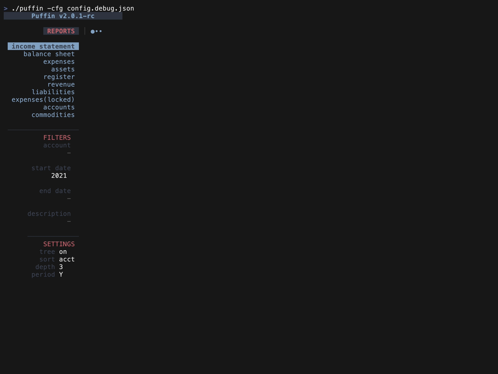

# Puffin

Terminal dashboard to manage personal finances. Built with [hledger](https://hledger.org/) and [bubbletea](https://github.com/charmbracelet/bubbletea).

<p>
    <a href="https://github.com/siddhantac/puffin/releases"></a>
    <a href="https://github.com/siddhantac/puffin/actions/workflows/go.yml"></a>
</p>
    
<a href="./altscreen-toggle/main.go">
  
</a>

# Features

All *hledger* reports are viewable using Puffin. Some of them are natively supported, others are displayed in a simple scrollable view. 

## View reports

Puffin supports the following reports natively:
- assets
- expenses
- revenue
- liabilities
- register
- accounts
- commodities

The following reports are also easily viewable:
- income statement
- balance sheet

## Filter reports
The data can be filtered by:
- account name
- start/end date
- displayed periodically - weekly, monthly, quaterly, yearly
- change account depth


# Installation

## Download binaries
If you just want to use it, you can download the binary from [here](https://github.com/siddhantac/puffin/releases).

## Install from source
### Pre-requisites

- [hledger](https://hledger.org/) is required for puffin to work.
- make
- Go compiler (>=1.17)

### Build

* Clone this repo
* Run the command `make build`. This creates the binary `puffin`.

### Run demo

* Clone this repo
* Run `make debug`

### Run with your own journal file

* Use `make start`

or

* Run using `make build && ./puffin`

It uses your hledger setup as it is. So there is no need to setup journal files if you are already using hledger.

## Configuration

Puffin can use a config file written in json. It is not required though. Without a config file Puffin will use sane defaults. 

The default config:

```json
"reports": [
    {
        "name": "register",
        "cmd": "hledger register"
    },
    {
        "name": "expenses",
        "cmd": "hledger balance type:x"
    },
    {
        "name": "assets",
        "cmd": "hledger balance type:a"
    },
    {
        "name": "revenue",
        "cmd": "hledger balance type:r"
    },
    {
        "name": "liabilities",
        "cmd": "hledger balance type:l"
    },
    {
        "name": "income statement",
        "cmd": "hledger incomestatement"
    },
    {
        "name": "balance sheet",
        "cmd": "hledger balancesheet"
    },
    {
        "name": "accounts",
        "cmd": "hledger accounts --tree",
        "locked": true,
    }
]


See [config.debug.json](config.debug.json) for more ideas.


### Keys

