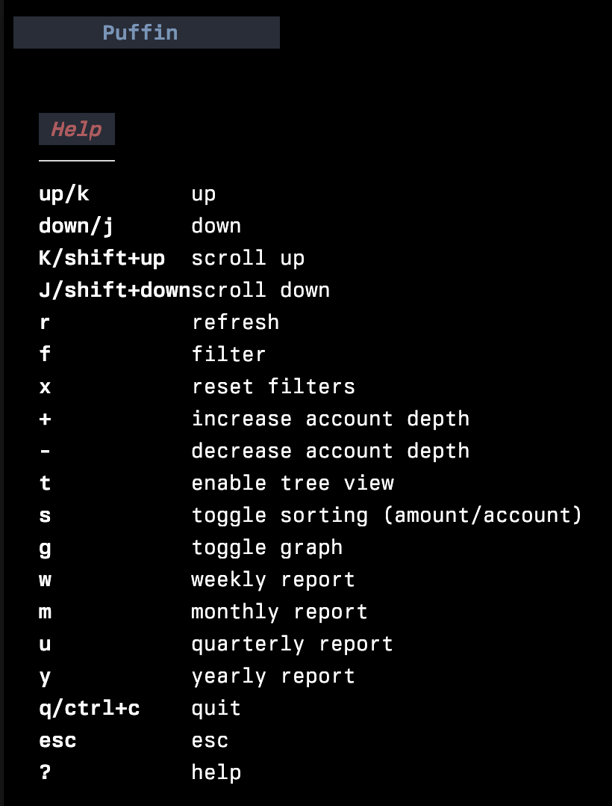

# Puffin

Terminal dashboard to manage personal finances. Built with [hledger](https://hledger.org/) and [bubbletea](https://github.com/charmbracelet/bubbletea).

<p>
    <a href="https://github.com/siddhantac/puffin/releases"></a>
    <a href="https://github.com/siddhantac/puffin/actions/workflows/go.yml"></a>
</p>
    
<a href="./altscreen-toggle/main.go">
  
</a>

# Table of Contents

- [📢 V3 announcement](#📢-v3-announcement)
- [💫 Features](#💫-features)
    - [📈 View reports](#📈-view-reports)
    - [🔎 Filter reports](#🔎-filter-reports)
- [🤖 Installation](#🤖-installation)
- [📝 Configuration](#📝-configuration)
    - [Keys](#keys)

# 📢 V3 announcement

A new version of Puffin is under active development. This version completely revamps the UI and gives you a far better overview of your finances. Some features have been implemented, while others are still being built.

To try V3, you can update to the latest version and run

```shell
./puffin -v3
```

Please note, **v3 does not use a config file yet**. So if you are using a config file with v2 then it won't be used with v3.

## V3 roadmap
- [x] Accounts table
- [x] Balance table
- [x] Register table
- [x] Income statement
- [x] Balance sheet
- [ ] Balance table with periodic columns
- [ ] Config file support
- [ ] Custom reports

# 💫 Features

All *hledger* reports are viewable using Puffin. Some of them are natively supported, others are displayed in a simple scrollable view. 

## 📈 View reports

Puffin supports the following reports natively:
- assets
- expenses
- revenue
- liabilities
- register
- accounts
- commodities

The following reports are also easily viewable:
- income statement
- balance sheet

## 🔎 Filter reports
The data can be filtered by:
- account name
- start/end date
- displayed periodically - weekly, monthly, quaterly, yearly
- change account depth

## 🎨 Themes
Puffin supports multiple color themes that can be switched dynamically:
- **Dracula** - Dark theme with vibrant pink and purple accents
- **Nord** - Clean arctic-inspired blue-gray theme  
- **Gruvbox** - Warm retro theme with bright pink accents

Press `Shift+T` while using the application to cycle through available themes. The current theme is displayed in the SETTINGS section.

For more details about themes, see [THEMES.md](THEMES.md).


# 🤖 Installation

## Homebrew

```bash
brew install siddhantac/puffin/puffin
```

## Download binaries
If you just want to use it, you can download the binary from [here](https://github.com/siddhantac/puffin/releases).

## Install from source
### Pre-requisites

- [hledger](https://hledger.org/) is required for puffin to work.
- make
- Go compiler (>=1.17)

### Build

* Clone this repo
* Run the command `make build`. This creates the binary `puffin`.

### Run demo

* Clone this repo
* Run `make debug`

### Run with your own journal file

* Use `make start`

or

* Run using `make build && ./puffin`

It uses your hledger setup as it is. So there is no need to setup journal files if you are already using hledger.


# Configuration

Puffin can use a config file written in json. It is not required though. Without a config file Puffin will use sane defaults. 

The default config:

```json
"reports": [
    {
        "name": "register",
        "cmd": "hledger register"
    },
    {
        "name": "expenses",
        "cmd": "hledger balance type:x"
    },
    {
        "name": "assets",
        "cmd": "hledger balance type:a"
    },
    {
        "name": "revenue",
        "cmd": "hledger balance type:r"
    },
    {
        "name": "liabilities",
        "cmd": "hledger balance type:l"
    },
    {
        "name": "income statement",
        "cmd": "hledger incomestatement"
    },
    {
        "name": "balance sheet",
        "cmd": "hledger balancesheet"
    },
    {
        "name": "accounts",
        "cmd": "hledger accounts --tree",
        "locked": true,
    }
]
```

- `name` represents the name of the report, as displayed in the left sidebar
- `cmd` is the hledger command to be run
- `locked`: if true, filters will **not be applied** to the report

**Note about locked reports** 
A report is considered "locked" if the `locked` field is set to true. A locked report remains unaffected by the filters. This means that they cannot be filtered by date, period, account name etc.

Locked reports are useful for 2 purposes
1. Reports where filters don't make sense, such as a list of accounts or commodities
2. Reports that you want to remain static. Such as a report with more a complex hledger command or other custom modifications.

See [config.debug.json](config.debug.json) for more ideas.


## Keys

Show this help with `?` 


