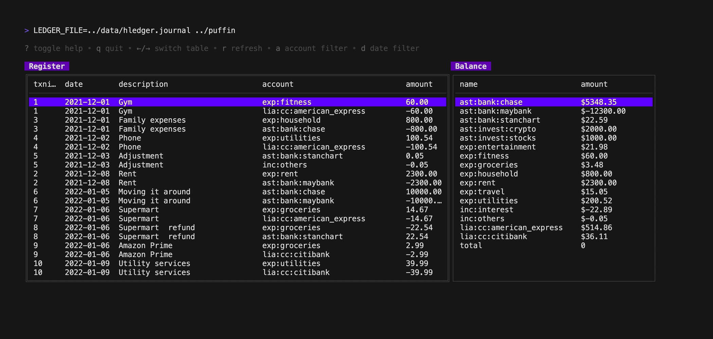

# Puffin
A bubbletea based TUI to manage personal finances using hledger

## Demo

### Browsing transactions and balance

### Account filter

### Date filter

## Installation

### Pre-requisite

[hledger](https://hledger.org/) is required for puffin to work.

### Run

* Clone this repo
* Run `make start`

## Features
- View transactions
- View account balance
- Filter transactions and balance by 
    - account name
    - date (smart queries only, eg. `last month` , `this year`)

### Keys

| Key | Feature |
| --- | --- |
| <kbd>?</kbd> | toggle help (to remove) |
| <kbd>q</kbd> | quit |
| <kbd>&#8592;</kbd> / <kbd>&#8594;</kbd> | switch between left/right tables |
| <kbd>r</kbd> | refresh data |
| <kbd>a</kbd> | filter by account name |
| <kbd>d</kbd> | filter by date |
| <kbd>s</kbd> | sort by oldest/newest |
| <kbd>/</kbd> | search by description |
    
## Planned
- [ ] Add new transactions
- [x] Filter by exact dates (eg. `2022/10`, `2021/06/23` etc)
- [ ] View reports (needs to be fleshed out more)
- [x] Change account depth using +/-
- [x] try to use register instead of print so that reg table also has acct depth

